

  

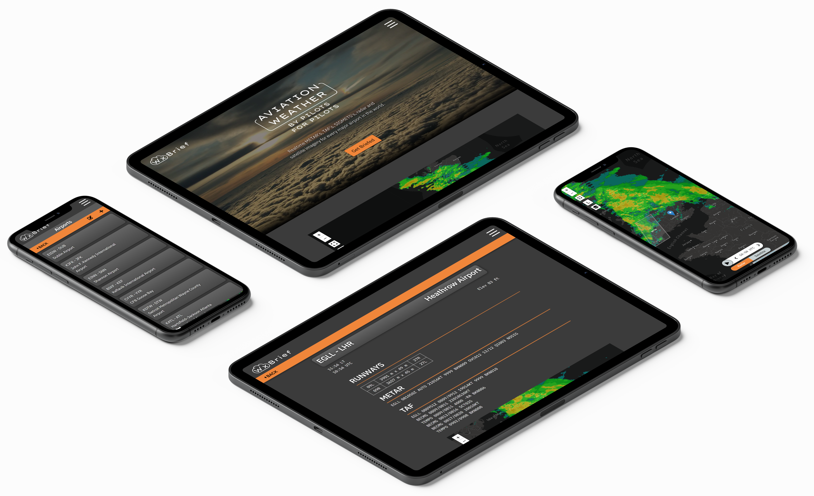
 
# Table of Contents
 
- [User Story Testing](#user-story-testing)

- [Manual Testing](#manual-testing)
    - [Header & Menu](#Header-&-Menu)
    - [Footer](#footer)
    - [Home Page](#home-page)
    - [Briefing Page](#briefing-page)
    - [About Page](#about-page)
    - [Contact Page](#contact-page)
    - [404 Page](#404-page)
- [Bugs](#bugs)
- [Automated Testing](#automated-testing)
    - [Google Lighthouse](#google-lighthouse)
    - [WAVE Tools](#wave-tools)
    - [W3C HTML Validator](#W3C-html-validator)
    - [W3C CSS Validator](#W3C-css-validator)
    - [Autoprefixer](#autoprefixer)
    - [A11y Color Contrast Checker](#a11y-color-contrast-checker)
 
# Testing
## User Story Testing
### **As a visitor to the site I want to see what services you provide.**
1. A user who initially lands on the site instantly sees the hero image in the background, hinting at the user the purpose of the site.
2. The logo further hints at the purpose of the site. Wx is short for weather and the cloud image around the letters adds to the impression of what the site is for.
3. The user sees the hero text that gives a brief description of the service.
4. Text below this gives further details on what the site offers.
5. An About page on the site gives further information to the user in an accordian type display. The subsections are About Us, FAQ and Legal Disclaimers.

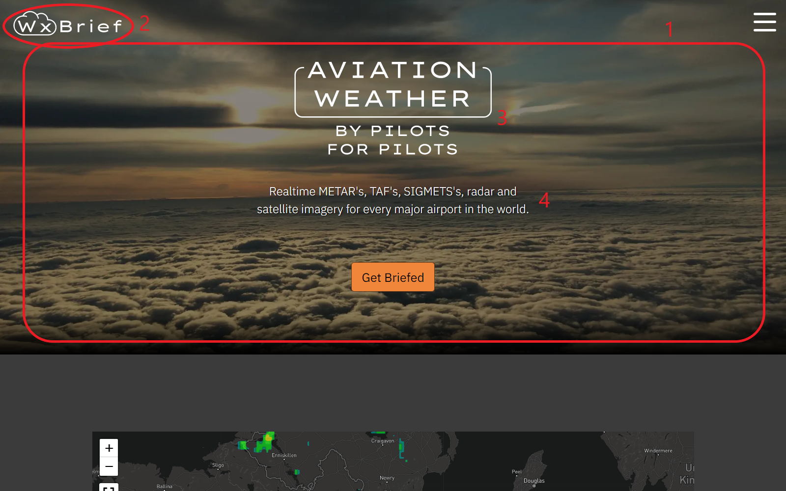
 

### **As a visitor to the site I want to understand the terminology used on the landing page so that I can get a better understanding of what the service offers me.**
1. The user will find this information in the FAQ section of the About Page.
2. In this section the user has some basic description of what a METAR and TAF is, along with basic instructions of how to read these reports.
3. Below the basic instructions of how to read the reports, there are links to US Air Force, UK CAA and Nav Canada documents containing a full description of how to read the reports.

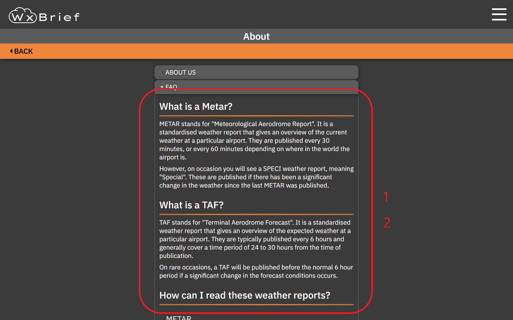
 
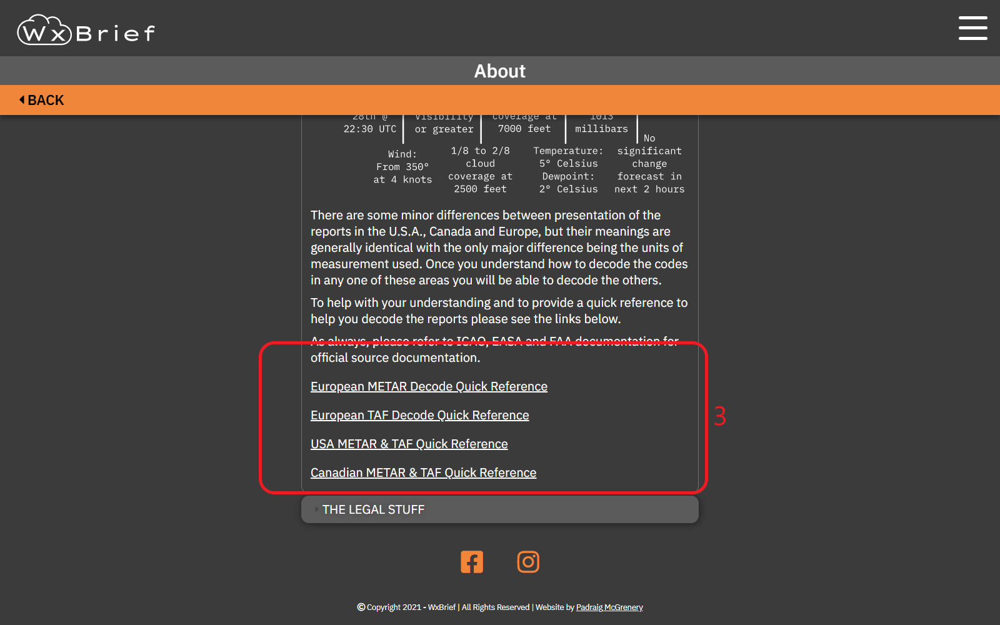
 

### **As a visitor, I want to find out more about your site, so that I can see more about the company and FAQ.**

1. The user can have both of these questions answered in the About Page. 

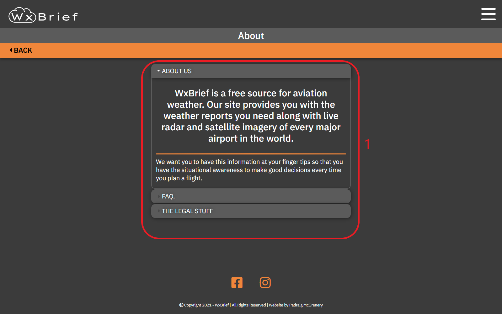
 

### **As a new user I want to see a sample list of airports so that I can see a sample of the service you provide.**
1.  When the user enters the Briefing page for the first time they will be presented with a modal giving a brief description of how to use the controls.
2. The modal also tells the user that a short list of sample airports has been added for them.
3. The user can then select any of the airports in the list so they can then go ahead and see the weather reports for that airport.
 
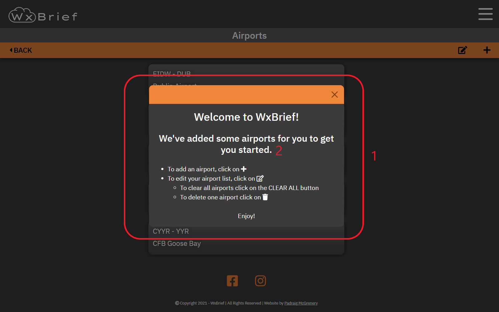
 

### **As a user, I want to see a quick overview of the current weather situation at my location, so that I can get a "big picture" overview of the current weather around me.**

1. When the user loads the site for the first time they are presented with a modal asking whether they would like to allow location or not.
2. If the user chooses not to allow location, then the map defaults to a view that shows Europe in one snapshot.
3. If the user chooses to allow location, then the map flys down to the users current location. The user can then see the radar returns at their location.

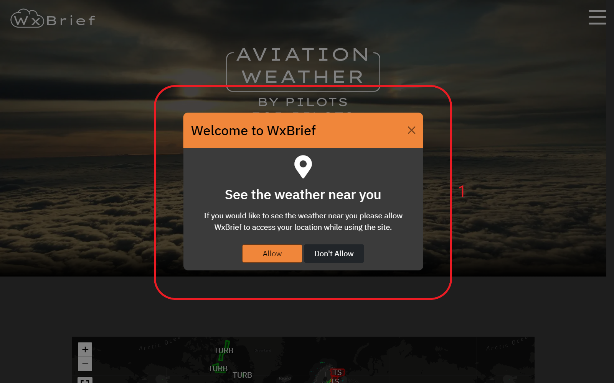
 
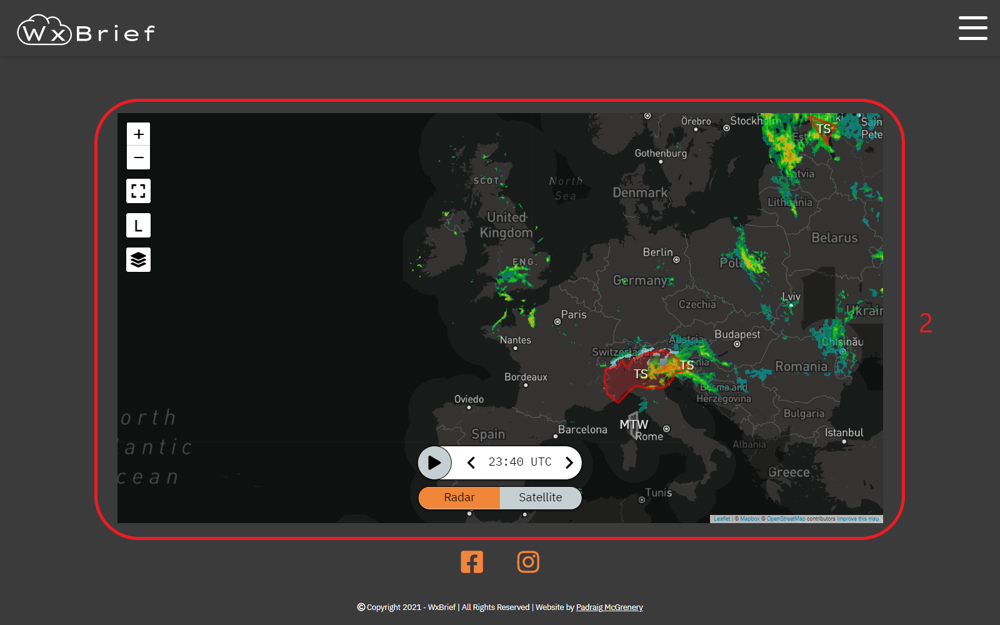
 
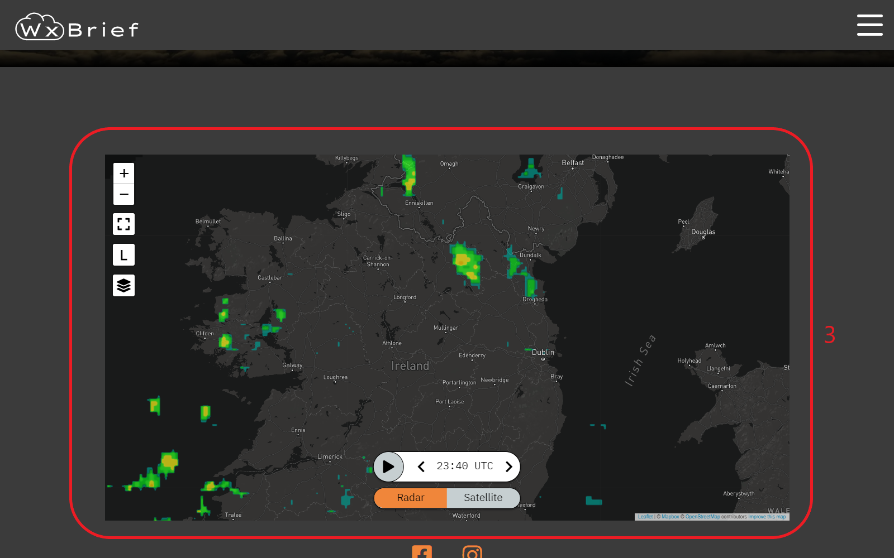
 
 
### **As a user, I want to see the current and forecast weather at a specific airport, so that I can know more about the weather at that airport.**

1. In the Briefing page, the user can add the airport they want to investigate.
2. The user selects that airport to enter the weather reports for that airport. 
3. This will load the wxreport.html page which presents the current and forecast weather to the user. The user will also see the radar map centered over the airport with a marker on the airport reference point.

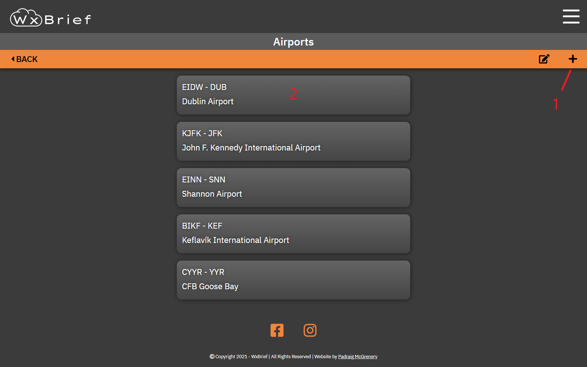
 
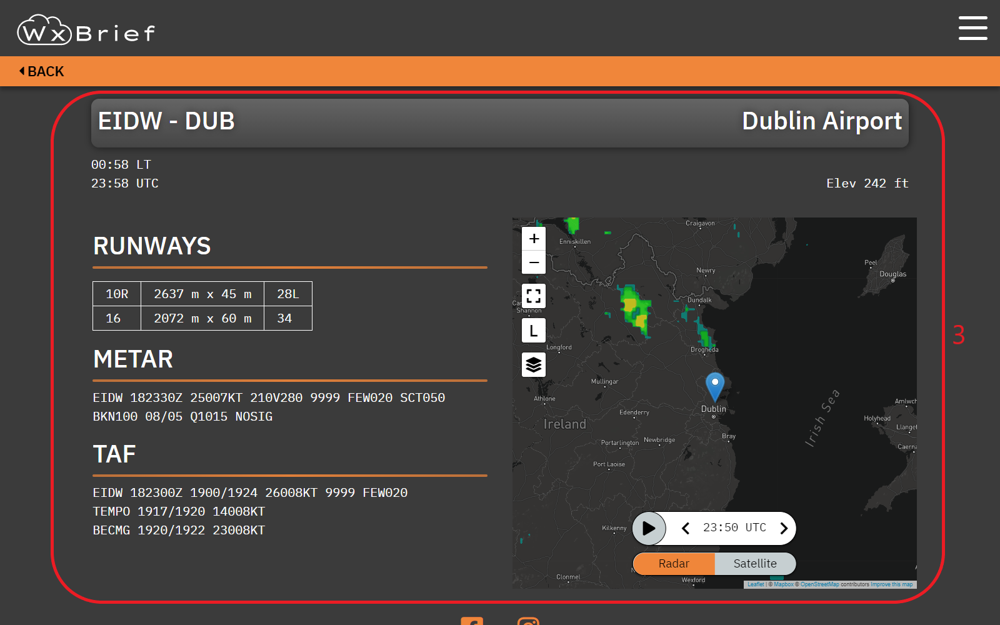
 

### **As a user, I want a list of the runways along with the lengths of the runways, so that I figure out which runway/runways is/are currently in use.**

1. On entering the weather report for a specific airport, the runways are automatically loaded for that airport also.
2. The user can then compare the runway directions to the current and forecast wind at the airport and make an assessment of the runway in use.

 

### **As a user, I want to know the current UTC time, and current local time, so that I can get a quick readout of the times and know what the timezone is.**

1. On entering the weather report for a specific airport, the user is also presented with the current UTC time and the local time at that airport.

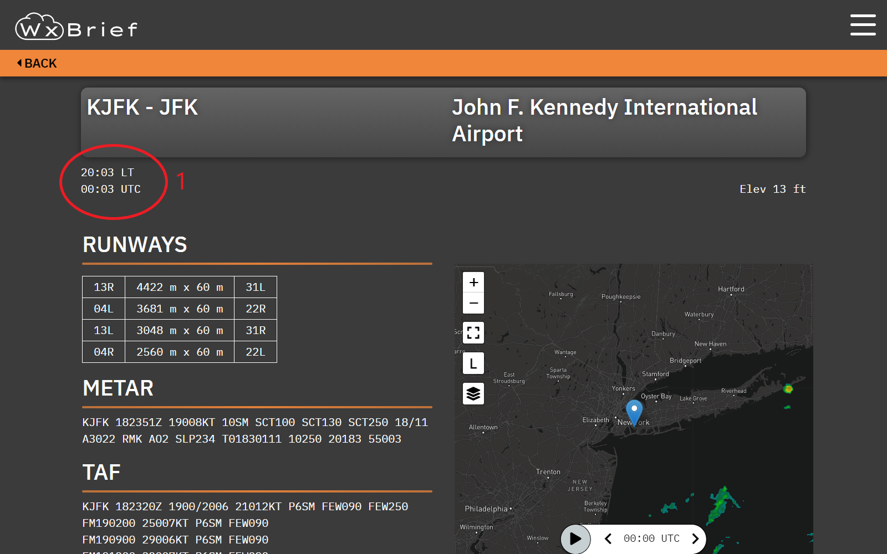
 

### **As a user, I want to know the elevation of the airport, so that I know if I can form an overall mental picture of the airport and so that I know whether I can expect any aircraft performance concerns or not.**

1. On entering the weather report for a specific airport, the user is also presented with the elevation of the airport in feet above sea level. The user can then make an assessment based on this data.

 

### **As a user, I want to add an airport to the list, so that I can see the weather at that airport.**

1. The user can add an airport by selecting the + icon on the controls bar or by selecting enter.
2. The user is presented with a modal that gives basic instructions of how to add an airport.
3. The user will recieve warnings in the modal if they fail to enter a known airport or enter the wrong number of characters.
4. The user then clicks Add Airport when they have entered the ICAO code.
5. The screen then smooth scrolls down to the bottom of the page to show the newly added airport.

 
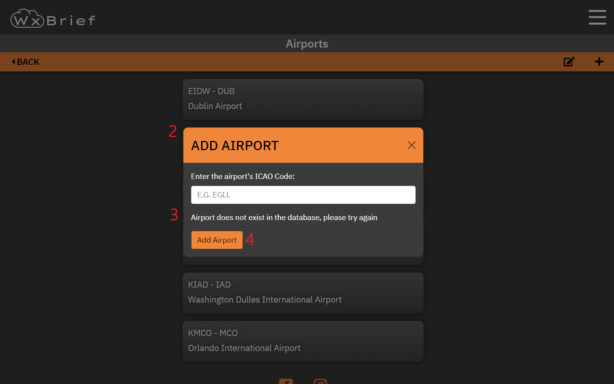
 

### **As a user, I want to delete an airport from the list of airports, so that I can declutter the list or remove airports that are no longer relevant to the flight.**

1. The user can click on the edit icon on the control bar.
2. A bin icon is added to each airport selector.
3. The user can select this icon and this will then delete that specific airport.
4. The airport slides up out of the list.

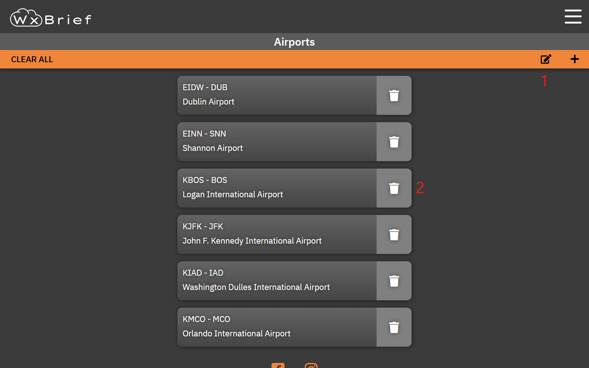
 

### **As a user, I want to build up a list of airports for today's flight, so that I can access the weather at each of the airports.**

1. The user can add a list of relevant airports one by one using the controls described above.

### **As a user, I want to be able to switch between radar and infrared satellite animations, so that I can get a good understanding of what the weather system looks like.**

1. At the bottom of the radar display there is a button to select between the two options. 
2. The current selection is highlighted in orange.

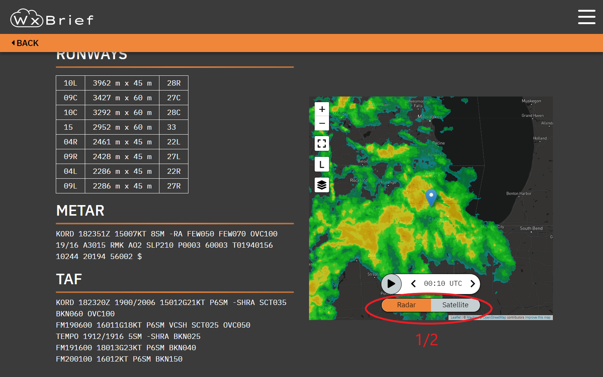
 

### **As a user, I want to be able to play/stop the radar animation as well as move from frame to frame, so that I can examine the current situation more thoroughly.**

1. In the control bar there is a play button to the left that allows the user to play and pasue the animation.
2. To the right of the play button there are controls to allow the user to skip forward or back one frame at a time.

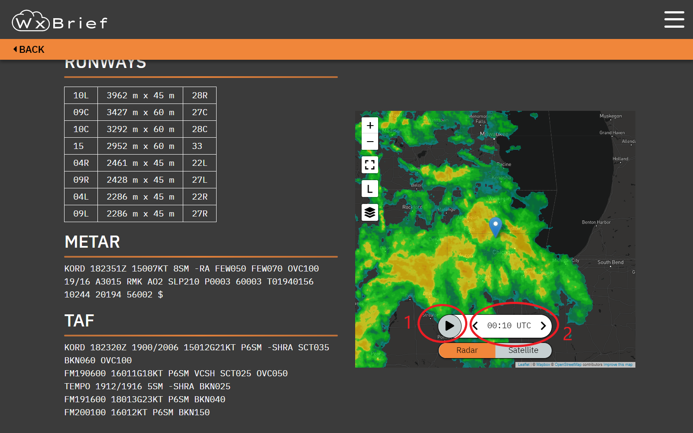
 

### **As a user, I want to know what areas are covered by radar so that I know the extents of the radar coverage.**

1. On the map there is a semi transparent overlay that shows the user the radar coverage.

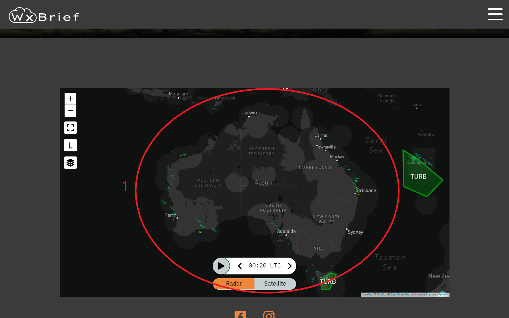
 

### **As a user, I want to know of any areas of significant weather outside the areas of radar coverage, so that I know what sectors of airspace to expect significant weather systems.**

1. SIGMET's are plotted on the map that show the user all known and forecast areas of significant weather across the entire globe. The SIGMET's cover areas of radar coverage and also remote areas.

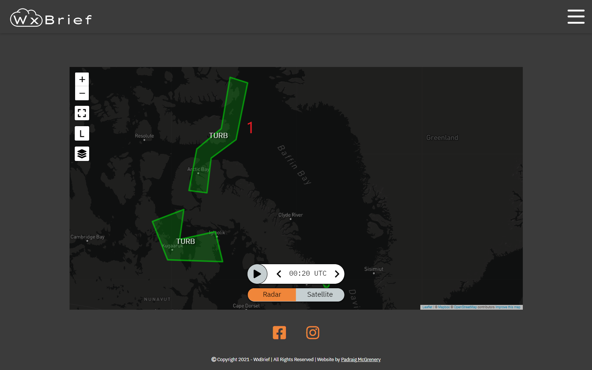
 

### **As a user, I want to have all SIGMETs plotted and I want to be able to see the full text of the SIGMET so I can get the full details of the affected altitudes, severity, type of hazard and any forecast changes.**

1. The SIGMET's are plotted as polygons on the map.
2. The user can click on the polygon to access the full SIGMET text in raw format. In this poopup bubble, the user can view all details of the weather hazard.

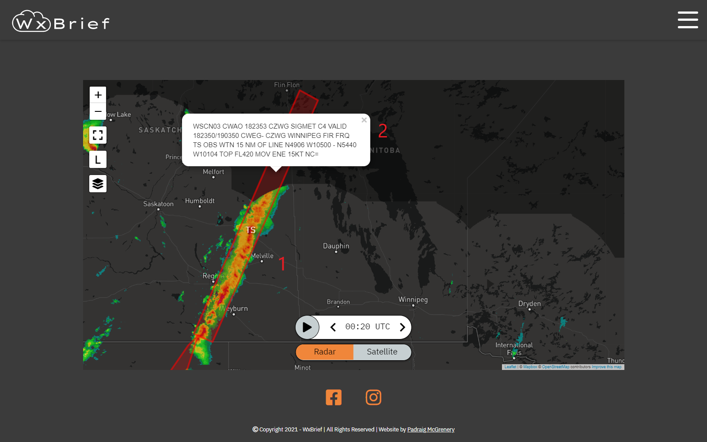
 

### **As a user, I want to be able to change the map base layer, so that I can customise the map to my preferences.**

1. On the left hand side of the map there are controls that allow the user to change the maps base layer. The user can click on the layer icon and then is presented with the 3 different map base layer options.

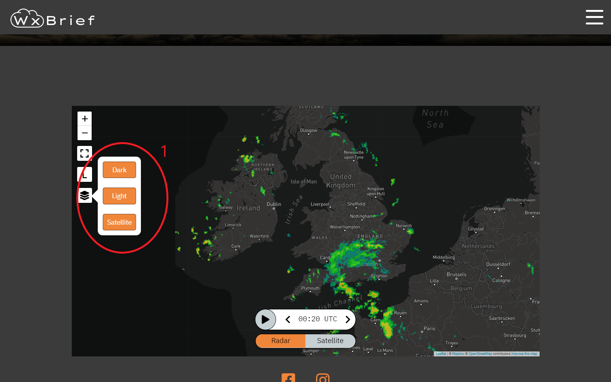
 

### **As a user, I want a colour coded legend so that I can tell what type of precipitation exists in the area I am focusing on.**

1. The user can click on the L icon on the left hand side of the map.
2. The user will then be presented with a legend on the right hand side of the map.
3. The user can then move the map around to focus on the area of interest and then compare the legend colours to find out the type of precipitation.

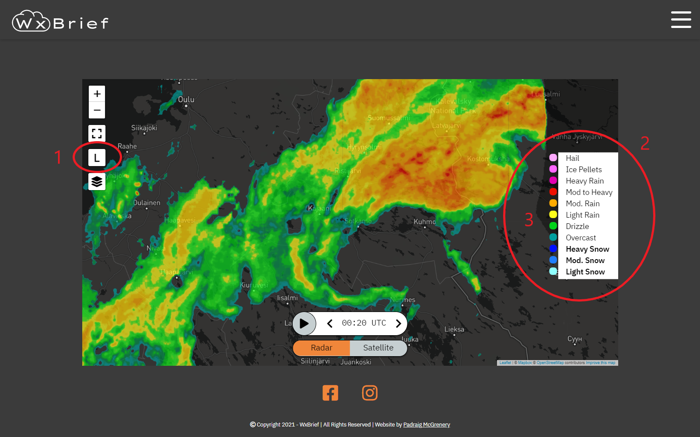
 

### **As a user, I want to be able to navigate across the map, so that I can see and zoom in on areas of interest.**

1. On mobile devices the user must use 2 fingers to move around and zoom in on the map.
2. On mobile devices when in fullscreen mode, the user can move around the map with one finger.
3. On all devices the user can zoom with the zoom buttons in the top left hand side of the map.
4. On screens larger than 480 px the user can pan across the map using one finger.
5. On laptops/PC's the user can click and drag the map to move around.
6. Users with a mouse can use the scroll button to zoom in and out.

### **As a user, I want a marker placed on the airport I am examining, so that when I pan across the map I can instantly see where the airport is and easily return to the area.**

1. When the user accesses the weather at an airport a marker is added at the airport reference point.

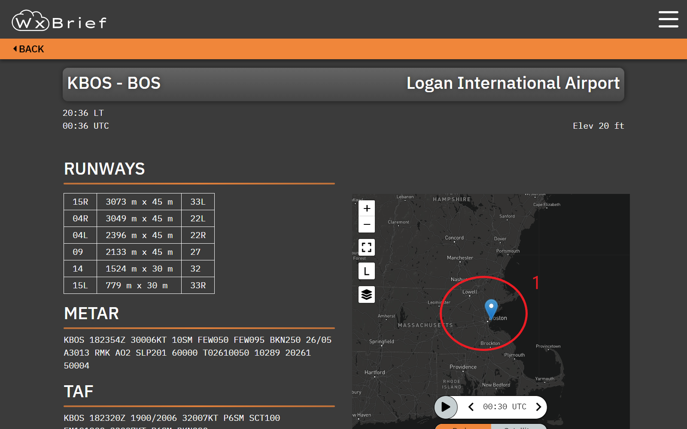
 

### **As a returning user I want the list of airports I created to be there when I come back later so that I can get an update on the current weather at airports that are relevant to the flight.**

1. When a user adds an airport, the new airport is added to a list in local storage. Every time the user accesses the briefing page this list is retrieved and displayed to the user.

### **As a returning user I want to clear the list of airports that I previously entered for a different flight and populate a new list of airports so that I have a list of airports specific to today flights.**

1. The user can click on the edit icon and then click on the Clear All button.
2. A modal fades in to double check with the user that they do in fact want to delete all airports.
3. When the user confirms that they want to clear all airports they can then click the Add Airport icon on the right hand side to repopulate the list.

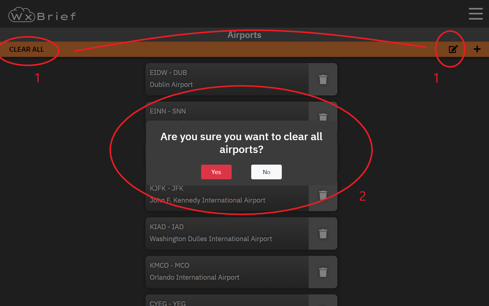
 

### **As a user, I want to be able to make contact with the site owner, so that I can let the owner know of an issue on the site.**

1. On the contact page the user can submit a message to the site admin for whatever reason they need to make contact.
2. Once the form has been filled out correctly and the user clicks submit, then a modal fades in to confirm successful form submission.

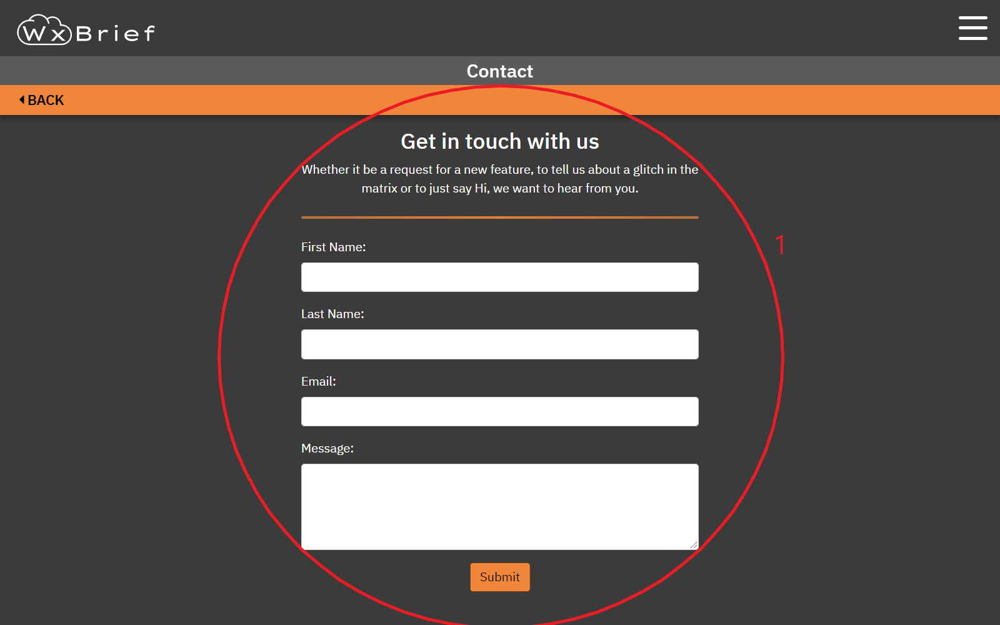
 
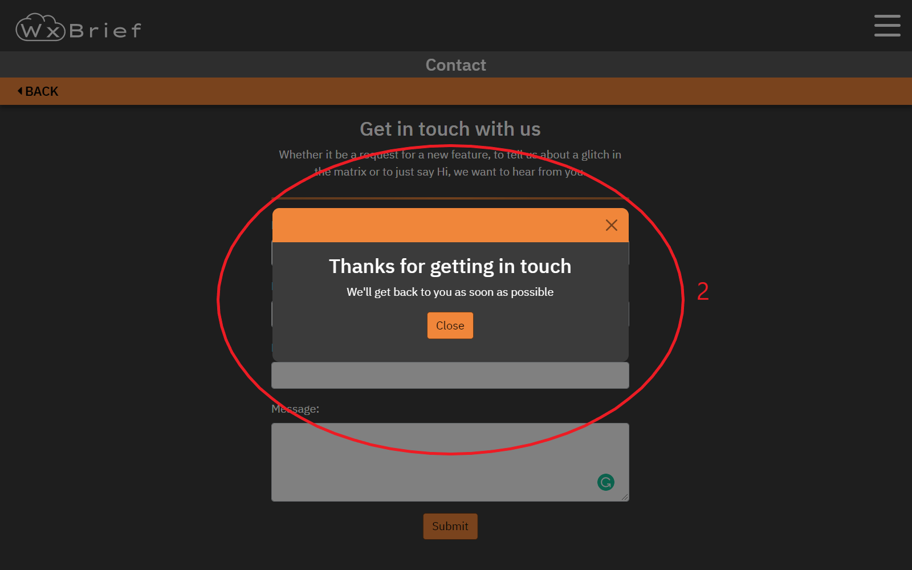
 

## Manual Testing

The following elements and sections were tested using Chrome Developer Tools.

Chrome's screen size emulator was used to test the site on different screen sizes. All of the elements listed in this manual tesing section were tested on the following screen sizes:

| Viewport Size (px)| Description | Bootstrap Breakpoint |
| -------------- |-------------| -----------------|
| 320 x 568 | iPhone5/SE in Portrait | XS |
| 375 x 667 | iPhone 6/7/8 in Portrait | XS |
| 568 x 320 | iPhone 5/SE in Landscape | SM |
| 667 x 375 | iPhone 6/7/8 in Landscape | SM |
| 768 x 1024 | iPad in Portrait | M |
| 1024 x 768 | iPad in Landscape | L |
| 1280 x 800 | Common Laptop | XL |
| 1366 x 768 | Common Laptop | XL |
| 1440 x 900 | Macbook Pro 15 | XXL |
| 1920 x 1080 | Common Large Desktop Monitor | XXL |
| 2560 x 1440 | 5K desktop monitor  | XXL |

### Header & Menu

- Checked that clicking on the logo icon navigates to the home page from each page.
- Checked the burger menu animates well on all devices.
- Checked that clicking the burger menu opens up the menu on all pages.
- Checked the menu links lead to the correct pages.
- Checked the logo is legible and an appropriate size on all devices.
- Checked the header becomes opaque when the user scrolls down.

<figure>
 
<figcaption>Header on a desktop</figcaption>
</figure>
 
<figure>
 
<figcaption>Header on a tablet</figcaption>
</figure>
 
<figure>
 
<figcaption>Header on a mobile</figcaption>
</figure>
  

### Footer
 
- Checked that the social media links work and open in new tabs.
- Checked that the footer is always at the bottom of the page or below the fold depending on how much content is on the page.

<figure>
 
<figcaption>Footer on a desktop</figcaption>
</figure>
 
<figure>
 
<figcaption>Footer on a tablet</figcaption>
</figure>
 
<figure style="display:block">
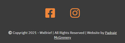 
<figcaption>Footer on a mobile</figcaption>
</figure>
 

### Radar Map

- Checked the map takes up the full size of its container.
- Checked the zoom buttons work correctly and zoom in an appropriate amount.
- Checked the full screen button stretches the map across the entire available area on the screen.
- Checked the legend button displays and hides the legend display
- Checked the map base layer button displays the three map options.
- Checked that clicking on each base layer option displays the chosen layer correctly and also still displays all information correctly.
- Checked that single finger panning across the map is disabled on small devices but available in full screen mode.
- Checked that two finger pannning and zooming works correctly on all touch devices.
- Checked that single finger panning is enabled on medium sized devices.
- Checked that click and drag and scroll zoom works with mouse controls.
- Checked that play/pause button animates and stops animations of radar and infrared sateillite.
- Checked that next/last frame buttons show the correct frames, and also that the animation is immediately stopped when they are pressed.
- Checked that the correct time is displayed.
- Checked that the radar/satellite selection works.
- Checked that the map flys down to the users location/Europe on the home page.
- Checked that a marker is added to the airport on the weather report page.

<figure>
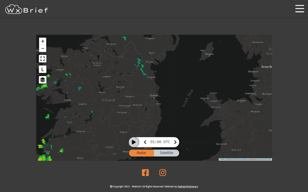 
<figcaption>Footer on a desktop</figcaption>
</figure>
 
<figure>
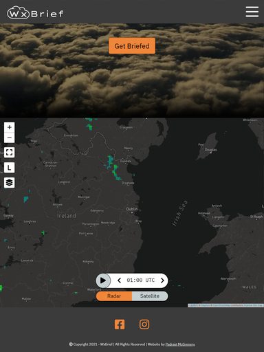 
<figcaption>Footer on a tablet</figcaption>
</figure>
 
<figure style="display:block">
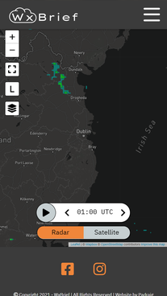 
<figcaption>Footer on a mobile</figcaption>
</figure>
 

### Home Page
 
- Checked the map appears just above the fold on mobile devices.
- Checked the radar map section appears well above the fold on large devices.
- Checked hero text and image displays well on all size displays.
- Checked the text over the image has an appropriate colour contrast.
- Checked the "Get Briefed" button links to the briefing page.
- Checked that new users are asked whether they want to allow location or not the first time they land on the page.

<figure>
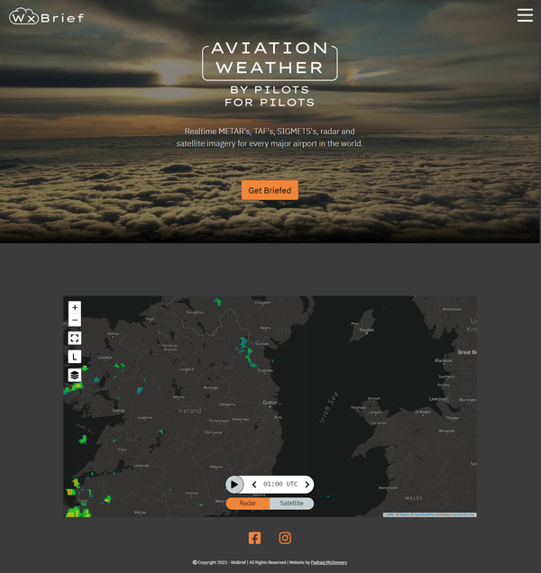 
<figcaption>Home page on a desktop</figcaption>
</figure>
 
<figure>
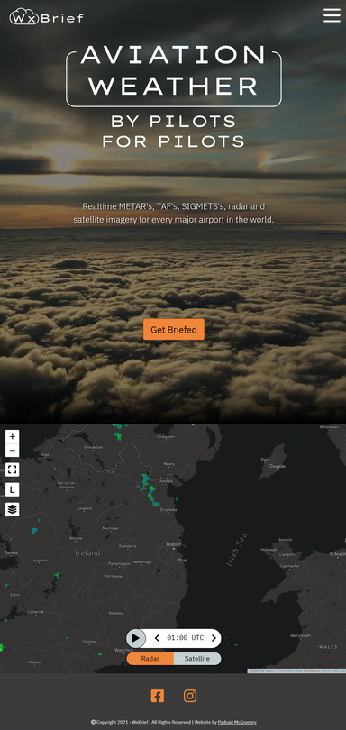 
<figcaption>Home page on a tablet</figcaption>
</figure>
 
<figure>
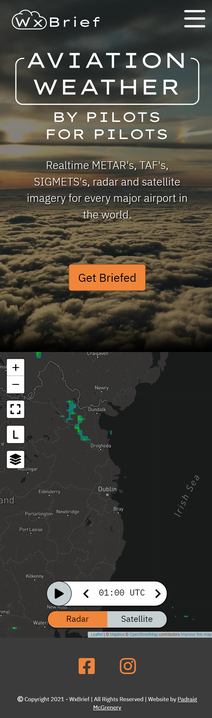 
<figcaption>Home page on a mobile</figcaption>
</figure>
 

### Briefing Page
 
- Checked that the control bar displays all controls clearly on all sizes of devices.
- Checked that the back buttons returns to the home page.
- Checked that clicking on the edit icon displays the delete icons on airports and replaces the back button with a clear all button.
- Checked that on the + icon displays the add airport modal.
- Checked that pressing Enter displays the add airport modal.
- Checked that pressing Esc hides the add airport modal.
- Checked that the users stored airports are displayed on the list.
- Checked that the welcome modal is displayed to new users.
- Checked that a default list of airports is displayed to new users.
- Checked that when clear all is pressed that a modal is displayed to the user to check they want to delete the airport list.
- Checked that the airports are all deleted when the user confirms they want to clear all airports.
- Checked that just the selected airport is deleted when the trash icon is clicked on.
- Checked that the add airport modal only accepts 4 letter codes and displays warnings to the user if anything other than 4 characters is typed in.
- Checked that the user recieves a warning if the airport is not in the database.
- Checked that the user cannot add an airport that is already in the list, and that the user receives a warning if they try to do so.
- Checked that pressing enter while the input is in focus adds the airport.
- Checked that clicking on an airport animates a button click.
- Checked that clicking on an airport links to the weather report page.

<figure>
 
<figcaption>Briefing on a desktop</figcaption>
</figure>
 
<figure>
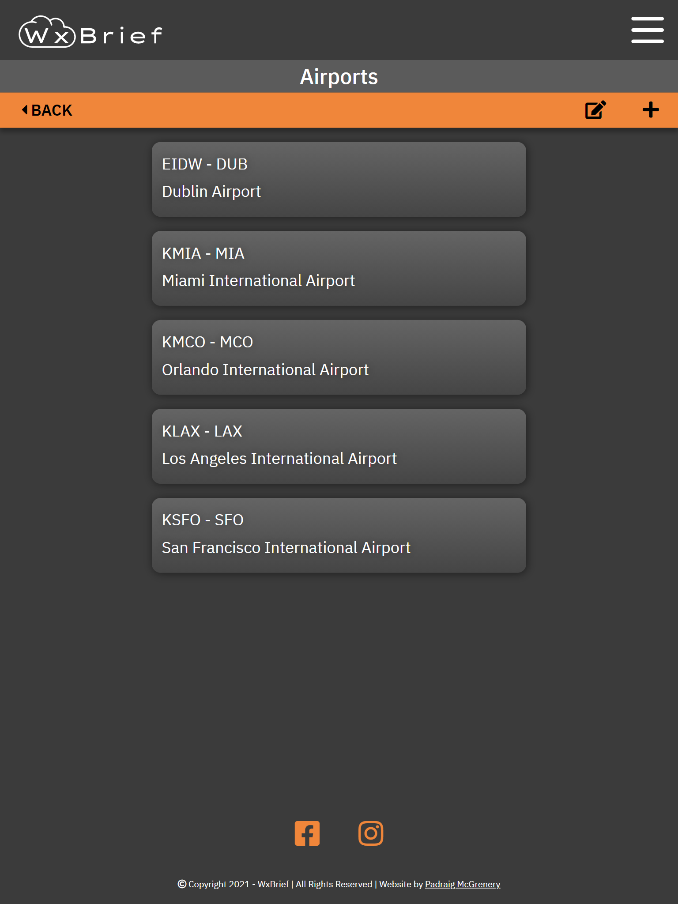 
<figcaption>Briefing on a tablet</figcaption>
</figure>
 
<figure>
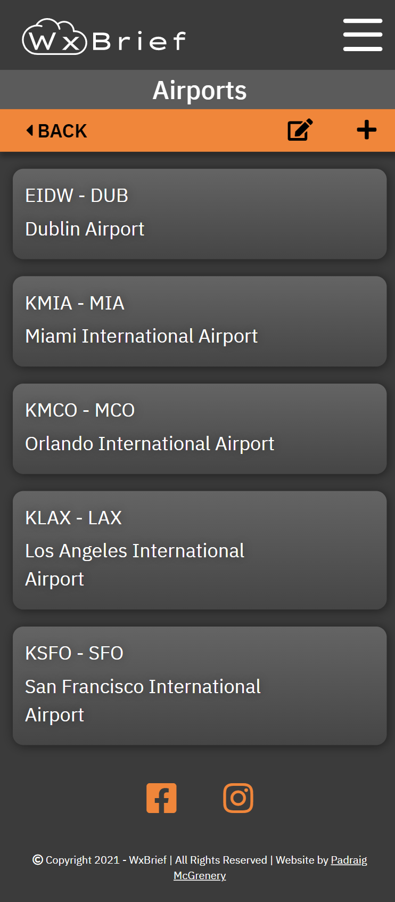 
<figcaption>Briefing on a mobile</figcaption>
</figure>

### Weather Report

- Checked that the header, METAR, TAF, airport information and radar appeared as intended on all screen sizes.
- Checked failure messages appear for METAR and TAF's if there is no data available for the selected airport.
- Checked that the back button leads to the briefing page.
- Checked that the displayed local time is correct for the selected airport.
- Checked the most recent weather reports were being displayed.
 
<figure>
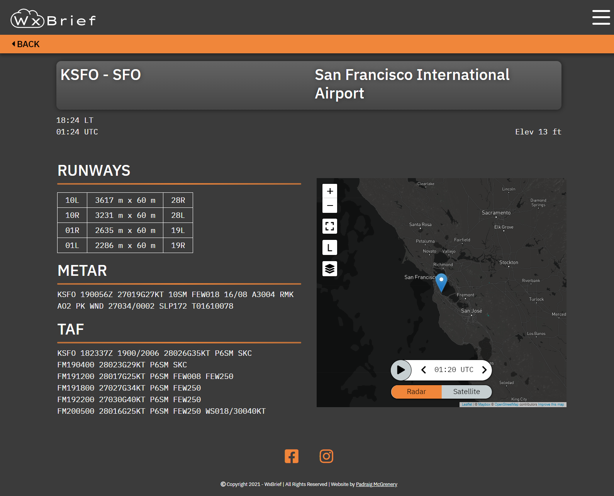 
<figcaption>Weather report on a desktop</figcaption>
</figure>
 
<figure>
 
<figcaption>Weather report on a tablet</figcaption>
</figure>
 
<figure>
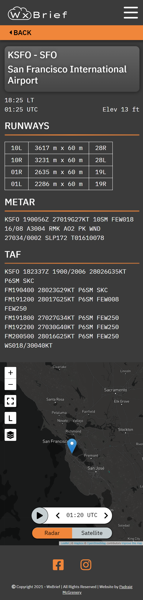 
<figcaption>Weather report on a mobile</figcaption>
</figure>
 

### About Page
 
- Checked that the back button leads to the home page.
- Checked that the accordion display animation works on all devices.
- Checked that the links in the FAQ section contain the correct pdf documents and open in a new window.

<figure>
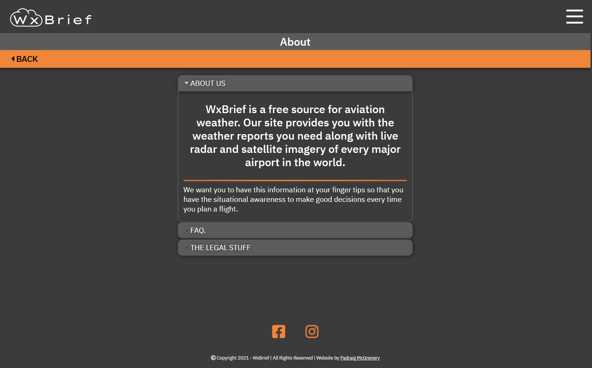 
<figcaption>About page on a desktop</figcaption>
</figure>
 
<figure>
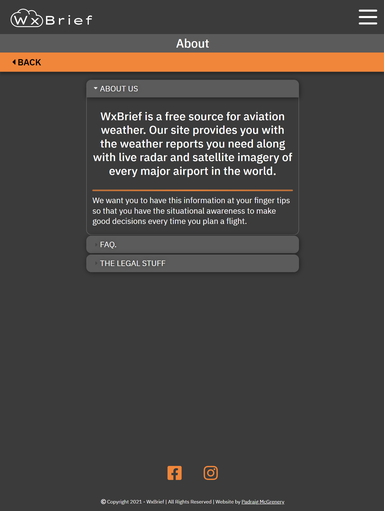 
<figcaption>About page on a tablet</figcaption>
</figure>
 
<figure>
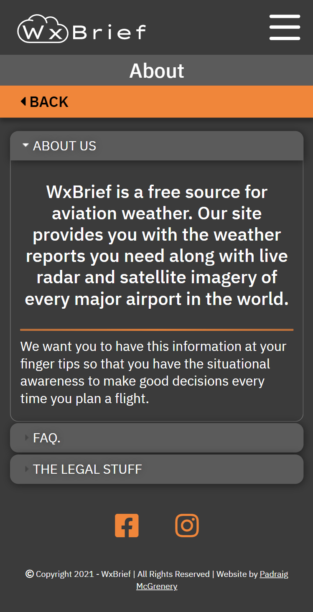 
<figcaption>About page on a mobile</figcaption>
</figure>
 

### Contact Page

- Checked that the back button leads to the home page.
- Checked that the form is displayed as intended on all screen sizes.
- Checked that all fields are required.
- Checked that all input types are correctly applied.
- Checked that user cannot submit form unless the form has been filled out correctly.
- Checked that the user is shown a modal confirming form submission after clicking submit.

<figure>
 
<figcaption>Contact page on a desktop</figcaption>
</figure>
 
<figure>
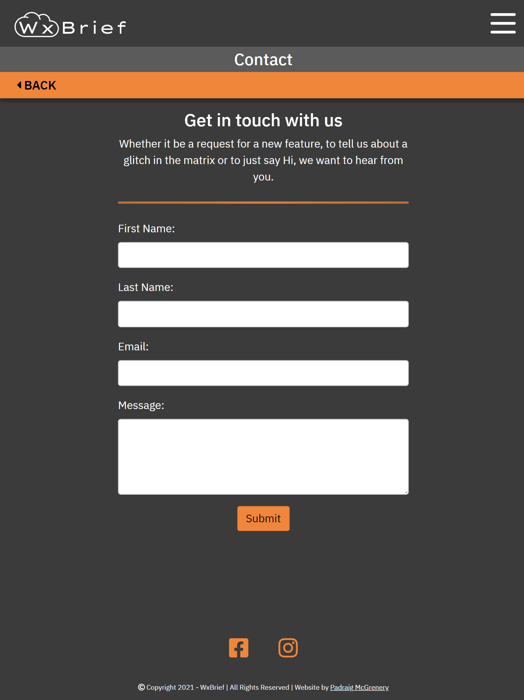 
<figcaption>Contact page on a tablet</figcaption>
</figure>
 
<figure>
 
<figcaption>Contact page on a mobile</figcaption>
</figure>
 

## Bugs

### Bugs Fixed:

1. Bug: When you enter a valid 4 letter ICAO code and click add airport, the modal remains in place with the value entered.
 Fix: After the object newAirport has been successfully passed to the function storeNewAirport I included two functions. The first function clears the input value and the second function hides the modal.

2. Bug: If the user doesn't enter a valid ICAO code and selects Add Airport a warning message appears. If the user subsequently decides to close the modal and then decides to open the modal again, the warning message is still in place.
 Fix: Add a function to clear all warnings when modals are closed.

4. Bug: After I add an airport to the list of airports and then try select any airport the <code>.onclick()</code> function is not being called. After some investigation, I found that this was due to the fact that the event listeners do not work well with dynamically created elements. [StackOverflow Article]("https://stackoverflow.com/questions/34896106/attach-event-to-dynamic-elements-in-javascript")
 Fix: Use event delegation to overcome the fact that the elements I'm trying to select are dynamically created. The event listener in place is now attached to the parent with <code>class="airports"</code> and it listens out for a click event on one of its children with a class of <code>"airport-selector"</code>.

5. Bug: The radar displays a forecast position of the weather radar returns as well as the actual historic conditions. At a quick glance this can lead to the impression that the weather is closer to an airport than it actually is which could effect the decision making process of the user.
 Fix: Remove the future frames from the rainviewer.js code. This also reduces the amount of data that has to be downloaded for each airport which improves the UX with a quicker load time.

6. Bug: After clearing all airports, if you press enter both modals appear.
 Fix: The reason for this was that after clicking on the Clear Airports button and either clicking on Yes/No/Close, then the button remains in focus. Therefore, when you press enter, it triggers the Clear Airports button as well as the event listener to call the Add Airport modal. The fix for this is to add <code>event.preventDefault()</code> to the event listener for pressing Enter.

7. Bug: On iPhones the installed full screen plug in for leaflet does not work. When clicked it enables single finger navigation of the map but does go to full screen. As well as this, the radar controls disappear once the map goes to fullscreen view.
 Fix: Removed the full screen plug in and replaced the initial plug in with the <code>.requestFullscreen()</code> method. Along with code to have cross browser compatibility it was discovered that it worked on everything except iPhones. Unfortunately, the method is not supported on iPhones. In the end, to allow cross browser compatibility I ended up with code that just takes the div containing the radar and toggles custom css styling. While this does not hide the address bar on mobile devices, it is the optimum solution to ensure the function works across all devices and also allows the radar controls to remain displayed in fullscreen.

8. Bug: Some buttons render differently on iPhones.
 Fix: After some research this is a known issue on iPhones, and the solution is to disable appearance settings that are autonmatically applied. [Stackoverflow article](https://stackoverflow.com/questions/5438567/css-submit-button-weird-rendering-on-ipad-iphone)

9. Bug: When you go to fullscreen on the map, tiles at the edge of the display do not load until you move the map so that the entire tile is in view.
 Fix: Apply <code>map.invalidateSize();</code> to the map every time the map changes from normal size to fullscreen size and vice versa. The root cause is that the div renders on the screen initially in normal size, the map essentially "remembers" this size and still thinks it is this size when it gets larger. So you just have to tell the map to forget its old size and to take the new size of the div as the size to be displayed. [Github post](https://github.com/Leaflet/Leaflet/issues/941)

10. Bug: When you zoom in and out and pan across the map for a while the SIGMET polygons disappear and sometimes they reappear when at the center of the screen. 
 Fix: After some research I found this is a known issue with the leaflet map when you plot geoJSON polygons to the map and assign the lines a weight. Originally the line weight for the polygons was set to a number value. The fix is just to remove the line weight value.

11. Bug: On the About Page there is a JQueryUI accordian type display. Originally, I put the code to call the JQueryUI function for this in the effects.js file. However, the library that this code is loaded from is only loaded on the about page. Therefore, an error is thrown on every other page as the <code>$.accordian</code> function is not recognised.
 Fix: The fix for this was to place the code inside a function that first checks that the current page url relates to the about page and then executes the code that calls the accordian function in the jQueryUI library.

12. Bug: On occasion the leaflet <code>layer.getBounds</code> function fails to work on international SIGMETS.
 Fix: To issue stemmed from an intermittent issue where the Leaflet <code>getBounds</code> function failed to work. This function was being used to get the extents of the polygon then the <code>getCenter</code> function was applied. A Leaflet marker was then applied to this point. To overcome this issue where <code>getBounds()</code> was intermittently not recognised, I changed over to using Leaflet's <code>bindTooltip</code> function instead which has a built in option to get the center of its parent.

### Existing Fixed:

1. Bug: On occasion some of the png tiles containing the radar/satellite pictures fail to load and a 404 error is displayed in the console. It appears rarely and generally only lasts for a period of 10 minutes. The issue is generally minimal as it is isolated to only a small number of tiles when it does happen and generally seems to effect tiles over Asia. This is an issue on Rainviewer's end and there is nothing I can do to solve this issue.

## Automated Testing
 
The site was tested using the following validators and online tools:
 
### Google Lighthouse
Based on initial results from Google Lighthouse the following changes were made to the site:
 
- Added a Meta description to each page.
- Added a 'rel="noopener"' attribute to the social media links to improve security.
- Text colour on the radar/ satellite had inadequate colour contrast against the orange background, so the text was changed to black.

There are some minor warnings remaining on the Google Lighthouse results: 

- Lighthouse has noted that the map tile images are too large, but there is no way to reduce the size of this resource and having tested it on airplane wifi I have not noted any issues regarding this even on slow wifi.

- An issue relating to SameSite cookies relating to the Mapbox tiles and the rainviewer png files. Fixing this cookie issue is beyond the scope of this project.

- A geolocation issue noting: "Requests the geolocation permission on page load". This is the result of a design choice to have the map geolocate to the users position when the page loads so the user can instantly see the weather situation around them. The accepted best practise is to request the users permission and to give the reason why this information is needed, and this has been implemented in this site by showing a modal to the new user requesting the location permission. If the user chooses not to allow permission then the map defaults to Europe and the code that calls for the geolocation is never called. If the user allows permission then the geolocation code is called and a variable is stored locally on the device so that the next time the site is loaded the permission request is not shown and the map goes straight to the users location. Lighthouse does not 'know' that this permission has previously been requested and hence the warning.

<figure>
    

        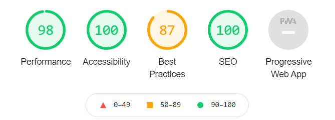
    

</figure>
<figcaption style="text-align:center">Lighthouse Test Results after changes were made</figcaption>
 
### WAVE Tools
Based on results from the web accessibility tool the following issues were fixed:
- Fixed the order of headings so that the site will make more sense to users.
- Removed unnecessary aria-labels.

The contrast error noted is due to the fact that the WAVE tool is unable to examine the SVG logo correctly. 
<figure>
    

        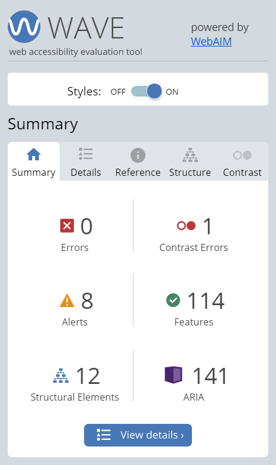
    

</figure>
<figcaption style="text-align:center">WAVE Test Results after changes were made</figcaption>
 
### W3C HTML validator
[W3C HTML Validator](https://validator.w3.org/) yielded no issues.
 
### W3C CSS validator
[W3C CSS Validator](https://jigsaw.w3.org/css-validator/) yielded no major issues, just some typo fixes.
 
### Autoprefixer
 
[Autoprefixer CSS Online](https://autoprefixer.github.io/) was used to check for any issues relating to prefixes in the CSS code. The test revealed several prefix ommisions and these were corrected as a result.
 
### A11y Color Contrast Checker
 
[A11y Color Contrast Accessibility Validator](https://color.a11y.com/Contrast/) Used to check the contrast of the colors to ensure the site meets accessibility standards. No issues were found and the actual contrast ratios well exceeded the accepted standards.

<figure>
    

        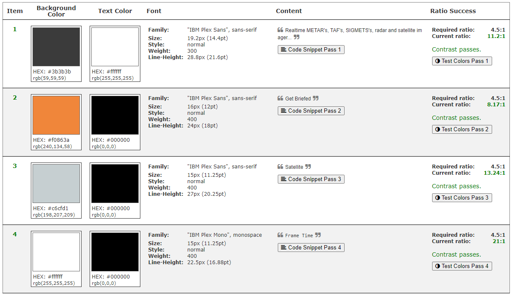
    

</figure>
<figcaption style="text-align:center">A11y Color Contrast Results</figcaption>